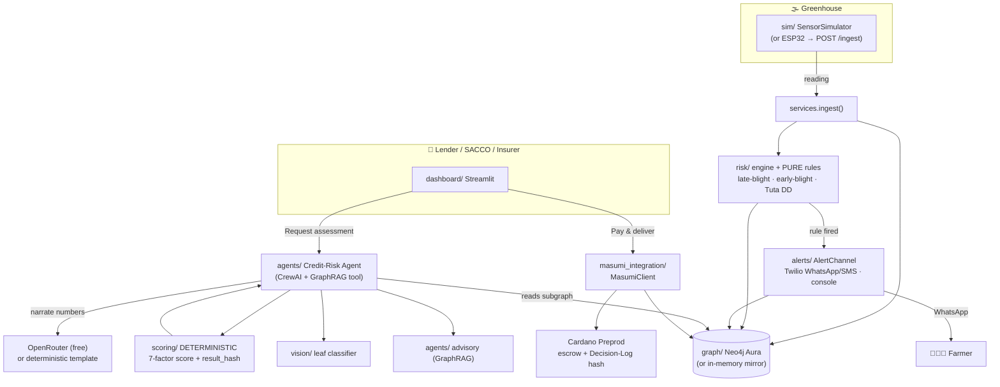
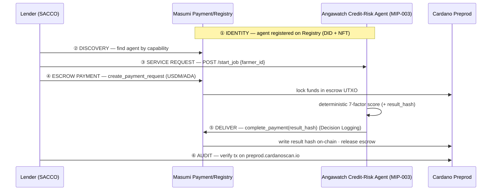

# Angawatch — Architecture

Angawatch has two intertwined loops on one **Neo4j** record:

1. **Guardian loop (AgriFin):** sensors/simulator → risk engine → farmer alert → graph.
2. **Finance loop (Masumi bounty):** a lender hires the Credit-Risk Agent → it scores the
   verified record → pays escrow → result hash is logged on-chain → audit.

The score-bearing logic (risk rules, credit factors) is **deterministic Python**; the LLM
only narrates. Every external dependency has a **clearly-labeled mock** fallback.

## System overview



## Where Masumi enters (identity · discovery · payment · audit)



Masumi plays a **real role** at all four points, not as a logo:
- **Identity:** `masumi_integration/` registers the agent (DID); MIP-003 endpoints in
  `masumi_integration/service.py` make it genuinely discoverable.
- **Discovery + service request:** `/availability`, `/input_schema`, `/start_job`, `/status`.
- **Escrow payment:** `RealMasumiBackend` uses the `masumi` SDK (`create_payment_request`,
  `check_payment_status`, `complete_payment`) on Cardano **Preprod** (USDM/ADA).
- **Audit:** the deterministic `result_hash` is Decision-Logged on-chain; verifiable on
  `preprod.cardanoscan.io`.

**Hybrid mode (default for the live demo):** the labeled `MockMasumiBackend` walks the same
five stages deterministically; if `MASUMI_PRERECORDED_TX` is set, the audit step shows a
**real** preprod transaction link (`proof_kind=prerecorded-real`) so judges see genuine
on-chain evidence while the live click-through never stalls on a fresh confirmation.

## Modules
| Dir | Responsibility |
|---|---|
| `config.py` | settings + `*_mode()` live/mock resolvers |
| `graph/` | Neo4j store + in-memory mirror; schema; seed; subgraph (GraphRAG contract) |
| `sim/` | sensor simulator + injectable event + ESP32 `/ingest` |
| `risk/` | PURE agronomic rules + engine |
| `alerts/` | AlertChannel (Twilio WhatsApp/SMS, console) |
| `scoring/` | PURE 7-factor credit score + result_hash |
| `agents/` | CrewAI Credit-Risk Agent + GraphRAG advisory + narration |
| `vision/` | PlantVillage tomato classifier (inference) |
| `masumi_integration/` | identity/registration, MIP-003, escrow, audit (real + labeled mock) |
| `dashboard/` | Streamlit lender app |
| `scripts/` | `seed_db.py`, `run_demo.py` |

## Live/mock matrix
| Capability | Live when | Mock fallback (labeled) |
|---|---|---|
| Graph | `NEO4J_*` set & reachable | in-memory store |
| Narration | `OPENROUTER_API_KEY` | deterministic template |
| Alerts | `TWILIO_*` | console message |
| Vision | local HF model | deterministic stub |
| Masumi | `MASUMI_MODE=real` + funded wallet | simulated round-trip (+ optional real tx link) |

Only the **simulator + deterministic cores** are required — pure local Python, no network.
```
