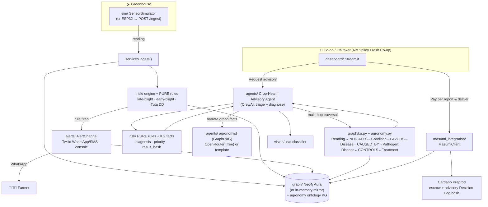
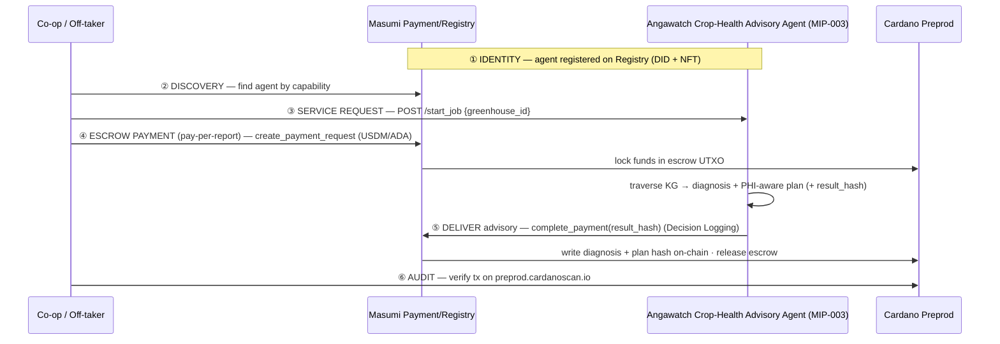

# Angawatch — Architecture

Angawatch has two intertwined loops on one **Neo4j** record:

1. **Guardian loop (AgriFin):** sensors/simulator → risk engine → farmer alert → graph.
2. **Advisory loop (Masumi bounty):** a co-op/off-taker hires the Crop-Health Advisory Agent →
   it triages contracted greenhouses, diagnoses the disease by traversing the agronomic
   knowledge graph, returns a PHI-aware treatment plan → pays per report → the diagnosis +
   plan hash is logged on-chain → audit.

The decision-bearing logic (risk rules + knowledge-graph traversals) is **deterministic
Python/Cypher**; the LLM only narrates the graph's facts. Every external dependency has a
**clearly-labeled mock** fallback.

> The earlier credit-score direction (a 7-factor score a lender hired/paid/audited) was
> **dropped** and moved to `archived/`: the farm data we can't yet trust, the lender already
> gets a better signal for free, and an on-chain audit of an *opinion* does no real work.
> Diagnosing disease from a traversable graph commits real, verifiable work to the chain.

## System overview



## Where Masumi enters (identity · discovery · payment · audit)



Masumi plays a **real role** at all four points, not as a logo:
- **Identity:** `masumi_integration/` registers the agent (DID); MIP-003 endpoints in
  `masumi_integration/service.py` make it genuinely discoverable. The co-op **discovers**
  the agent and issues a service request with `{greenhouse_id}`.
- **Discovery + service request:** `/availability`, `/input_schema`, `/start_job`, `/status`,
  `/provide_input`, `/demo`. `client.run_round_trip(report)` drives the cycle; a Sokosumi
  coworker lives in `masumi_integration/sokosumi.py`.
- **Escrow payment (pay-per-report):** `RealMasumiBackend` uses the `masumi` SDK
  (`create_payment_request`, `check_payment_status`, `complete_payment`) on Cardano
  **Preprod** (USDM/ADA).
- **Audit:** the deterministic `result_hash` commits to the **diagnosis + plan** (canonical
  JSON, sha256). `masumi_integration/onchain.py` writes tx metadata (label **8434**, type
  `"advisory-decision-log"`: agent, subject, diagnosis, priority, result_hash); verifiable on
  `preprod.cardanoscan.io`. Logging a verifiable diagnosis is real work, not an opinion.

**Hybrid mode (default for the live demo):** the labeled `MockMasumiBackend` walks the same
five stages deterministically; if `MASUMI_PRERECORDED_TX` is set, the audit step shows a
**real** preprod transaction link (`proof_kind=prerecorded-real`) so judges see genuine
on-chain evidence while the live click-through never stalls on a fresh confirmation.

## Modules
| Dir | Responsibility |
|---|---|
| `config.py` | settings + `*_mode()` live/mock resolvers |
| `graph/` | Neo4j store + in-memory mirror; `agronomy.py` ontology data; `kg.py` seed + Cypher traversals + Python fallback (GraphRAG contract) |
| `sim/` | sensor simulator + injectable event + ESP32 `/ingest` |
| `risk/` | PURE agronomic rules + engine (with KG traversals, the verifiable core) |
| `alerts/` | AlertChannel (Twilio WhatsApp/SMS, console) |
| `agents/` | `advisory.py` (AdvisoryAgent + AdvisoryReport) · `agronomist.py` (GraphRAG explain) · narration |
| `vision/` | PlantVillage tomato classifier (inference) |
| `masumi_integration/` | identity/registration, MIP-003 `service.py`, `client.py`, escrow, `onchain.py` audit, `sokosumi.py` (real + labeled mock) |
| `dashboard/` | Streamlit co-op app |
| `scripts/` | `seed_db.py`, `run_demo.py` |

## Live/mock matrix
| Capability | Live when | Mock fallback (labeled) |
|---|---|---|
| Graph | `NEO4J_*` set & reachable | in-memory store |
| Narration | `OPENROUTER_API_KEY` | deterministic template |
| Alerts | `TWILIO_*` | console message |
| Vision | local HF model | deterministic stub |
| Masumi | `MASUMI_MODE=real` + funded wallet | simulated round-trip (+ optional real tx link) |

Only the **simulator + deterministic cores** are required — pure local Python, no network.
```
